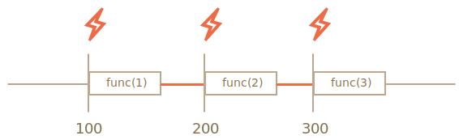
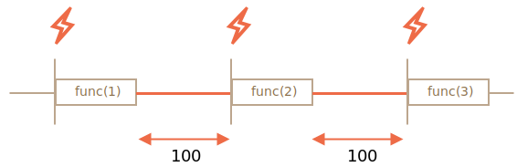

Функция `function setTimeout(func, delay)` позволяет запускать код, помещённый в неё с задержкой. 

```js
function sayHi() {
  alert('Привет');
}
setTimeout(sayHi, 1000);
```
Также `finction setInterval(func, int)` позволяет запускать через какой-то промежуток времени, Метод `setInterval` имеет такой же синтаксис как setTimeout:

```js 
  let timerId = setInterval(func, delay)
```

Мы можем прекратить выполнение `setTimeout()` и `setInterval()` в определённый момент с помощью функции clearTimeout() 

```js 
  let timerId = setTimeout(() => alert("Ничего не происходит"), 1000)
  clearTemeout(timerId);
```

Выполнение `setInterval()`

```js
let i = 1;
setInterval(function() {
  func(i);
}, 100);
```

Что будет если функция внутри `setInterval` выполняется дольше 100 мс? 

В данном случае движок ждёт окончания выполнения `func` и затем проверяет планировщик и, если время истекло, немедленно запускает его снова.

В крайнем случае, если функция всегда выполняется дольше, чем задержка `delay`, то вызовы будут выполняться без задержек вообще.

Это нормально, потому что время, затраченное на выполнение `func`, использует часть заданного интервала времени.

Т.е. `setInterval` во время задержки начинает выполнять функцию.

 

Что бы это избежать можно использовать рекурсивный setTimeout()
```js
let i = 1;
setTimeout(function run() {
  func(i);
  setTimeout(run, 100);
}, 100);
```
Ниже представлен процесс работы рекурсивного setTimeout()

 

Рекурсивный setTimeout() гарантирует фиксированную задержку (здесь 100 мс).

Т.е сначала выполняем функцию, потом делаем задержку. 
